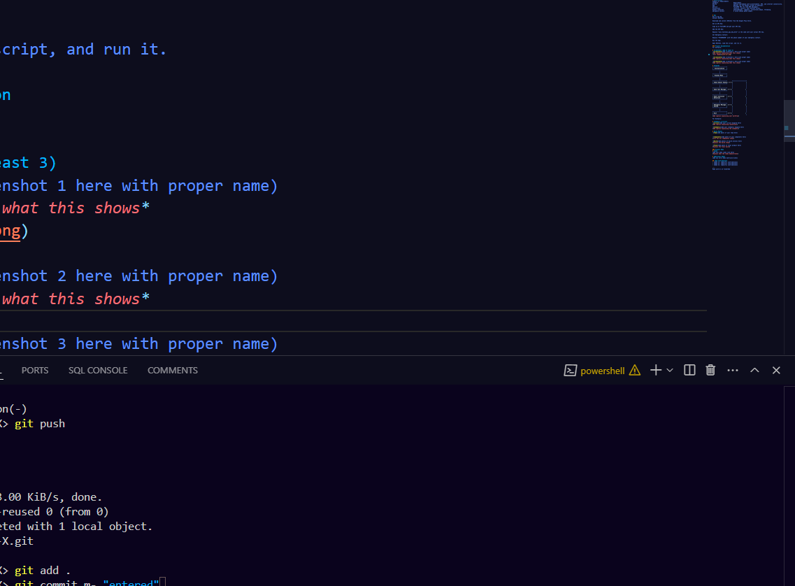

# [Project Name] 🎯

## Basic Details
### Team Name: GuardianX

### Team Members
- Member 1: Silpa KS - Amal Jothi College Of Engineering
- Member 2: Diya Roy -  Amal Jothi College Of Engineering
- Member 3: Rose Mathew -  Amal Jothi College Of Engineering

### Hosted Project Link
[mention your project hosted project link here]

### Project Description
The Guardian X enhances road safety by detecting collisions, predicting threats, and providing real-time alerts. It integrates accelerometer data, GPS tracking, Bluetooth communication, and emergency notifications to reduce accident response time and improve driver awareness.

### The Problem statement
**Problem Statement:**  
Road accidents are a leading cause of fatalities due to delayed emergency response and lack of real-time threat detection. Existing safety measures often fail to provide immediate alerts or predictive warnings to drivers. Our System addresses this gap by threat prediction, and emergency communication to enhance road safety and reduce accident response time.

### The Solution
We solved this problem by developing the Guardian X that uses accelerometer data for collision detection, GPS for location tracking, and predictive analytics to assess potential threats. The system provides emergency SMS notifications ensuring faster response and improved road safety.

## Technical Details
### Technologies/Components Used
For Software:
- python
- SL4A
- androidhelper,requests,collection.deque,time
- QPython,Fast2SMS API

For Hardware:
- [List main components]
- [List specifications]
- [List tools required]

### Implementation
For Software:
# Installation
Summary of Requirements
Category	                  Requirement
Device	                      Android smartphone with accelerometer, GPS, and internet connectivity.
App	                          QPython (to run Python scripts on Android).
Service	                      Fast2SMS API (to send SMS messages).
Permissions	                  Location, sensors, and internet access.
Python Libraries	          androidhelper, requests, collections.deque, threading.
Emergency Contact	          A valid Indian phone number.

# Run
How to Set Up
Install QPython:

Download and install QPython from the Google Play Store.

Get an API Key:

Sign up on Fast2SMS and get your API key.

Add the API Key:

Replace "your_fast2sms_api_key_here" in the code with your actual API key.

Set Emergency Contact:

Replace "9745098490" with the phone number of your emergency contact.

Run the App:

Open QPython, load the script, and run it.

### Project Documentation
For Software:

# Screenshots (Add at least 3)

*Add caption explaining what this shows*
 

 
*

*Add caption explaining what this shows*

# Diagrams
+-------------------+
|  Initialization   |
+-------------------+
          |
          v
+-------------------+
|  Display Menu     |
+-------------------+
          |
          v
+-------------------+       +-------------------+
| Check Sensor Status| <----|                   |
+-------------------+       |                   |
          |                 |                   |
          v                 |                   |
+-------------------+       |                   |
| Send Test Message | <----|                   |
+-------------------+       |                   |
          |                 |                   |
          v                 |                   |
+-------------------+       |                   |
| Start Collision   | <----|                   |
| Detection         |       |                   |
+-------------------+       |                   |
          |                 |                   |
          v                 |                   |
+-------------------+       |                   |
| Emergency Message | <----|                   |
| System            |       |                   |
+-------------------+       |                   |
          |                 |                   |
          v                 |                   |
+-------------------+       |                   |
| Exit              | <----|                   |
+-------------------+       |                   |
*Add caption explaining your workflow*

For Hardware:

# Schematic & Circuit

*Add caption explaining connections*

*Add caption explaining the schematic*

# Build Photos

*List out all components shown*

*Explain the build steps*

*Explain the final build*

### Project Demo
# Video
[Add your demo video link here]
*Explain what the video demonstrates*

# Additional Demos
[Add any extra demo materials/links]

## Team Contributions
- [Name 1]: [Specific contributions]
- [Name 2]: [Specific contributions]
- [Name 3]: [Specific contributions]

---
Made with ❤️ at TinkerHub